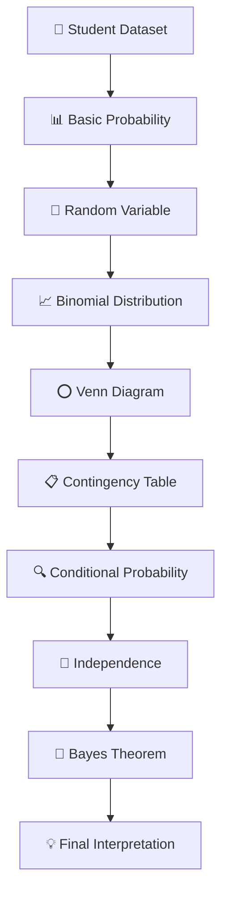

# 📊 PR-1 | Expectation Decider

<p align="center">
  <strong>Probability & Statistics Project — Student Performance Analysis</strong><br>
  Using probability, random variables, binomial distribution, Venn diagrams, contingency tables, conditional probability, independence, and Bayes theorem.
</p>

<p align="center">
  
  
  
  
  
</p>

---

## 🧭 Quick Navigation

<details open>
<summary><strong>Click to explore the project</strong></summary>

- [📌 Overview](#-overview)
- [📂 Project Files](#-project-files)
- [📊 Dataset](#-dataset)
- [🎯 Project Objectives](#-project-objectives)
- [🧠 Probability Basics](#-probability-basics)
- [🎲 Random Variable & Binomial Distribution](#-random-variable--binomial-distribution)
- [⭕ Venn Diagram Analysis](#-venn-diagram-analysis)
- [📋 Contingency Table](#-contingency-table)
- [🔗 Independence](#-independence)
- [🧮 Bayes Theorem](#-bayes-theorem)
- [📈 Key Results](#-key-results)
- [📝 Project Notes](#-project-notes)
- [🚀 How to Run](#-how-to-run)
- [💡 Conclusion](#-conclusion)

</details>

---

## 📌 Overview

**Expectation Decider** is a probability and statistics project focused on student examination outcomes.

The project uses a student dataset to demonstrate how probability can be applied to questions such as:

- What is the probability that a student passes?
- What is the probability that attendance is above 80%?
- How does group-discussion participation relate to passing?
- How many students out of 3 selected students are expected to pass?
- Are two student-performance events independent?
- How can Bayes theorem be used to estimate the probability of passing given high attendance?

The uploaded notebook contains the computational workflow, while the uploaded handwritten notes document the mathematical reasoning and results.

---

# 📂 Project Files

| File | Purpose |
|---|---|
| `PR1_Expectation_Decider(1).ipynb` | Main Python/Jupyter Notebook |
| `expectation_decider_dataset(1).csv` | Student dataset used for analysis |
| `Notes.pdf` | Six-page handwritten project notes and mathematical working |
| `README.md` | Interactive project documentation |

<details>
<summary><strong>📖 What is inside Notes.pdf?</strong></summary>

The six-page notes cover:

- Probability definition and formula
- Key probability terms
- Empirical and theoretical probability
- Random variable
- Binomial probability distribution
- Mean and variance
- Venn diagram analysis
- Contingency table
- Joint, marginal and conditional probability
- Independence
- Bayes theorem

The notes are handwritten and presented across six project pages. fileciteturn2file0L1-L7

</details>

---

# 📊 Dataset

The uploaded CSV contains **200 student records**.

### Dataset columns

| Column | Meaning |
|---|---|
| `study_hours` | Student study hours |
| `attendance` | Attendance percentage |
| `group_discussion` | Group-discussion participation |
| `previous_test_score` | Previous test score |
| `final_exam_pass` | Final examination outcome |

<details>
<summary><strong>🔎 Dataset snapshot</strong></summary>

| Metric | Value |
|---|---:|
| Total students | **200** |
| Passed | **70** |
| Failed | **130** |
| Pass probability | **0.3500 (35.00%)** |
| Fail probability | **0.6500 (65.00%)** |

</details>

---

# 🎯 Project Objectives

<details open>
<summary><strong>Expand objectives</strong></summary>

### 1️⃣ Understand Probability

Understand the probability of an event occurring using:

**P(E) = Favorable Outcomes / Total Outcomes**

### 2️⃣ Compare Probability Types

Compare observed/empirical probability with the theoretical probability used in the project.

### 3️⃣ Model a Random Variable

Define `X` as the number of students who pass when **3 students are randomly selected**.

### 4️⃣ Apply Binomial Distribution

Calculate the probability of obtaining 0, 1, 2, or 3 passing students.

### 5️⃣ Analyze Events with a Venn Diagram

Study the relationship between:

- **A:** Students studying more than 10 hours
- **B:** Students with attendance greater than 80%

### 6️⃣ Analyze a Contingency Table

Study the relationship between group-discussion participation and final-exam outcome.

### 7️⃣ Test Independence

Compare conditional probability with marginal probability.

### 8️⃣ Apply Bayes Theorem

Use high attendance information to estimate the probability of passing.

</details>

---

# 🧠 Probability Basics

The handwritten notes define probability as the chance of an event happening.

### Formula

```text
P(E) = Favorable Outcome / Total Outcomes
```

### Key Terms

<details>
<summary><strong>📚 View definitions</strong></summary>

| Term | Meaning |
|---|---|
| **Experiment** | An activity that gives an outcome |
| **Outcome** | Result of an experiment |
| **Sample Space** | Set of all possible outcomes |
| **Event** | A particular outcome/event of interest |
| **Conditional Probability** | Probability of an event when another event is known |

</details>

---

# 🎲 Random Variable & Binomial Distribution

The project defines:

> **X = number of students who pass when 3 students are randomly selected.**

Therefore:

```text
X ∈ {0, 1, 2, 3}
```

Using the uploaded dataset, the observed pass probability is:

```text
p = 0.3500
q = 0.6500
```

### Binomial Formula

```text
P(X = x) = C(n,x) × pˣ × q⁽ⁿ⁻ˣ⁾
```

where:

```text
n = 3
p = probability of passing
q = probability of failing
```

### Distribution from the uploaded dataset

| X | Probability |
|---:|---:|
| **0** | **0.274625 (27.46%)** |\n| **1** | **0.443625 (44.36%)** |\n| **2** | **0.238875 (23.89%)** |\n| **3** | **0.042875 (4.29%)** |\n
### 📐 Mean

```text
Mean = np
     = 3 × 0.3500
     = 1.0500
```

### 📐 Variance

```text
Variance = np(1-p)
         = 0.6825
```

<details>
<summary><strong>💡 Interpretation</strong></summary>

The random variable represents the number of successful/pass outcomes among three selected students. The binomial model gives the probability for each possible number of passes.

</details>

---

# ⭕ Venn Diagram Analysis

The project defines two events:

```text
A = Students who study more than 10 hours
B = Students whose attendance is greater than 80%
```

### Dataset-based set breakdown

| Region | Students |
|---|---:|
| 🟦 A only | **58** |
| 🟩 B only | **35** |
| 🟨 A ∩ B | **32** |
| ⬜ Neither | **75** |

<details>
<summary><strong>🔎 Understanding A ∩ B</strong></summary>

The intersection represents students satisfying **both** conditions:

```text
study_hours > 10
AND
attendance > 80
```

The handwritten notes specifically highlight the overlapping portion as the students satisfying both conditions. fileciteturn2file0L4-L4

</details>

---

# 📋 Contingency Table

The project examines:

```text
Group Discussion × Final Exam Result
```

### Dataset table

| Group Discussion | Pass | Fail | Total |
|---|---:|---:|---:|
| **Yes** | 39 | 79 | 118 |
| **No** | 31 | 51 | 82 |
| **Total** | **70** | **130** | **200** |

---

## 🔢 Joint Probability

The project calculates the probability that a student:

**participates in group discussion AND passes.**

```text
P(Group Discussion ∩ Pass)
= 39 / 200
= 0.1950
```

---

## 📌 Marginal Probability

The overall probability of passing is:

```text
P(Pass)
= 70 / 200
= 0.3500
= 35.00%
```

---

## 🔍 Conditional Probability

The probability of passing **given group-discussion participation** is:

```text
P(Pass | Group Discussion)
= 39 / 118
= 0.3305
= 33.05%
```

The handwritten notes also demonstrate this conditional-probability calculation using the contingency table. fileciteturn2file0L5-L5

---

# 🔗 Independence

The project uses conditional probability to examine whether group-discussion participation and passing are independent.

The basic comparison is:

```text
P(Pass | Group Discussion)
        vs
P(Pass)
```

If the two values are equal, the events are independent under the probability definition being used.

<details>
<summary><strong>📊 Project interpretation</strong></summary>

The handwritten notes state that the two probabilities are not equal and therefore conclude that the events are **dependent**.

The notes explain that group-discussion participation and passing are not mutually exclusive: a student can participate in group discussion and also pass the exam. fileciteturn2file0L6-L6

</details>

---

# 🧮 Bayes Theorem

The project includes a separate Bayes theorem example based on the probabilities written in the notes.

### Given

```text
P(High Attendance | Pass) = 0.70
P(High Attendance | Fail) = 0.40
P(High Attendance)        = 0.60
```

Using total probability, the project obtains:

```text
P(Pass) = 0.6667
```

Then Bayes theorem is applied:

```text
P(Pass | High Attendance)
=
P(High Attendance | Pass) × P(Pass)
------------------------------------
       P(High Attendance)
```

The final result written in the notes is:

```text
P(Pass | High Attendance) = 77.78%
```

The handwritten final page records the Bayes calculation and the resulting **77.78%** probability. fileciteturn2file0L7-L7

<details>
<summary><strong>⚠️ Important source distinction</strong></summary>

The Bayes section uses the probabilities explicitly written in the handwritten notes. These values should therefore be treated as the **project's Bayes example inputs**, rather than automatically assuming they are the same as the empirical probabilities calculated from the CSV.

</details>

---

# 📈 Key Results

| Analysis | Result |
|---|---:|
| 👨‍🎓 Total Students | **200** |
| ✅ Passed | **70** |
| ❌ Failed | **130** |
| 🎯 P(Pass) | **35.00%** |
| 📚 P(Fail) | **65.00%** |
| 👥 P(Group Discussion ∩ Pass) | **19.50%** |
| 🎯 P(Pass \| Group Discussion) | **33.05%** |
| 🧮 Bayes P(Pass \| High Attendance) | **77.78%** |

---

# 📝 Project Notes

The handwritten **Notes.pdf** contains six pages of project work. fileciteturn2file0L1-L7

<details>
<summary><strong>📄 Page-by-page contents</strong></summary>

### Page 1
Probability definition, formula, key terms, dataset examples and empirical probability.

### Page 2
Empirical/theoretical probability and the random variable/binomial distribution setup.

### Page 3
Binomial mean and variance followed by Venn diagram analysis.

### Page 4
Contingency table, joint probability, marginal probability and conditional probability.

### Page 5
Independence analysis and the beginning of Bayes theorem.

### Page 6
Completion of the Bayes theorem calculation and the final **77.78%** result.

</details>

---

# 🔄 Project Workflow



---

# 🛠️ Technologies

<p align="center">
  
  
  
  
  
</p>

---

# 🚀 How to Run

<details open>
<summary><strong>1️⃣ Install Python dependencies</strong></summary>

```bash
pip install pandas numpy matplotlib jupyter
```

</details>

<details>
<summary><strong>2️⃣ Open the notebook</strong></summary>

```bash
jupyter notebook "PR1_Expectation_Decider(1).ipynb"
```

</details>

<details>
<summary><strong>3️⃣ Keep the CSV beside the notebook</strong></summary>

```text
PR1_Expectation_Decider(1).ipynb
expectation_decider_dataset(1).csv
```

</details>

<details>
<summary><strong>4️⃣ Run all cells</strong></summary>

Run the notebook from top to bottom to reproduce the project's calculations and visualizations.

</details>

---

# 📁 Recommended Repository Structure

```text
PR1-Expectation-Decider/
│
├── 📓 PR1_Expectation_Decider(1).ipynb
├── 📊 expectation_decider_dataset(1).csv
├── 📄 Notes.pdf
├── 📘 README.md
│
└── 🖼️ images/
    └── project-preview.png
```

---

# 💡 Conclusion

The **Expectation Decider** project demonstrates how probability and statistics can be applied to student-performance data.

The project progresses from basic probability to more advanced concepts:

```text
Probability
     ↓
Empirical / Theoretical Probability
     ↓
Random Variable
     ↓
Binomial Distribution
     ↓
Venn Diagram
     ↓
Contingency Table
     ↓
Conditional Probability
     ↓
Independence
     ↓
Bayes Theorem
```

The uploaded dataset provides the empirical student-performance analysis, while the handwritten notes provide the mathematical explanation and project calculations.

---

<p align="center">

<strong>📊 PR-1 | EXPECTATION DECIDER</strong><br>

<em>Probability • Statistics • Data Analysis • Python</em>

</p>
# 👨‍💻 Author

## Indrajeet Maheshwari ##

AI & Data Science Student

`Python` · `Pandas` · `NumPy` · `Statistics`