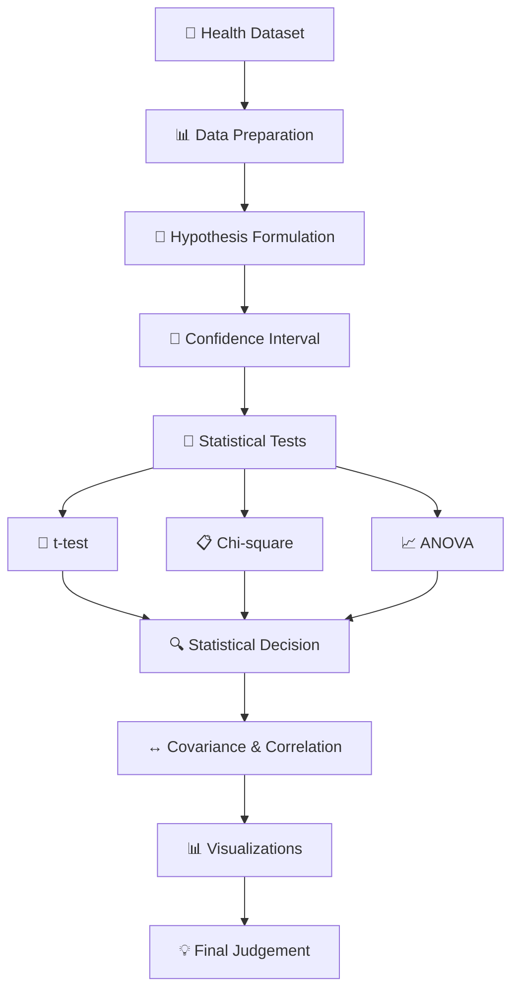

# 📊 PR-2 | Derivable Judgement

<p align="center">
  <strong>Mathematics & Advanced Statistics Project — Statistical Decision Making</strong><br>
  Using inferential statistics, hypothesis testing, confidence intervals, p-values, critical values, t-test, chi-square test, ANOVA, covariance, and correlation.
</p>

<p align="center">
  
  
  
  
  
  
</p>

---

## 🧭 Quick Navigation

<details open>
<summary><strong>Click to explore the project</strong></summary>

- [📌 Overview](#-overview)
- [📂 Project Files](#-project-files)
- [🎯 Objectives](#-objectives)
- [📖 Part A — Theory](#-part-a--theory)
- [🧪 Part B — Practical Analysis](#-part-b--practical-analysis)
- [🗃️ Dataset](#️-dataset)
- [🧠 Hypotheses](#-hypotheses)
- [📐 Statistical Methods](#-statistical-methods)
- [📊 Visual Results](#-visual-results)
- [🔄 Project Workflow](#-project-workflow)
- [🚀 How to Run](#-how-to-run)
- [📁 Repository Structure](#-repository-structure)
- [💡 Conclusion](#-conclusion)
- [👨‍💻 Author](#-author)

</details>

---

## 📌 Overview

**Derivable Judgement** is a Mathematics & Advanced Statistics project focused on using sample data to make statistical decisions.

The project connects the concepts written in the theory section with a Python-based practical analysis. The practical uses a synthetically generated health-record dataset and demonstrates how different statistical tests are selected according to the type of data and the question being asked.

The project covers:

- Inferential statistics
- Hypothesis testing
- Confidence intervals
- Critical values
- p-values
- Type I and Type II errors
- z-test and t-test concepts
- Chi-square test
- ANOVA
- Covariance
- Correlation
- Data visualization

The repository contains the notebook, dataset, theory screenshots, and practical result screenshots.

---

# 📂 Project Files

| File / Folder | Purpose |
|---|---|
| `PR2_PartB_Derivable_Judgement_Humanized.ipynb` | Main Python/Jupyter practical |
| `health_records_dataset.csv` | Generated health-record dataset |
| `screenshots/` | Theory and practical screenshots |
| `README.md` | Interactive project documentation |

<details>
<summary><strong>📖 What is included in the screenshots?</strong></summary>

The repository contains **2 theory screenshots** showing the handwritten Part A work and **3 practical screenshots** showing the statistical visualizations.

The five screenshots are kept in the repository so the project documentation and practical work can be viewed directly from GitHub.

</details>

---

# 🎯 Objectives

<details open>
<summary><strong>Expand objectives</strong></summary>

### 1️⃣ Understand Inferential Statistics

Use sample information to understand how conclusions can be made about a population.

### 2️⃣ Formulate Hypotheses

Create:

- **Null Hypothesis (H₀)**
- **Alternative Hypothesis (H₁)**

### 3️⃣ Apply Statistical Testing

Use suitable statistical tests for numerical and categorical variables.

### 4️⃣ Calculate Confidence Intervals

Estimate a population parameter using a specified confidence level.

### 5️⃣ Interpret p-values and Critical Values

Use a 5% significance level to make statistical decisions.

### 6️⃣ Study Relationships

Use covariance and correlation to understand relationships between numerical variables.

### 7️⃣ Present Results

Use charts and short interpretations to communicate the findings.

</details>

---

# 📖 Part A — Theory

The handwritten theory section contains the eight required conceptual topics.

<details>
<summary><strong>📚 View the eight topics</strong></summary>

| No. | Topic |
|---:|---|
| 1 | Inferential Statistics |
| 2 | Hypothesis Testing and its Components |
| 3 | Confidence Interval and Critical Value |
| 4 | p-value |
| 5 | Type I and Type II Errors |
| 6 | z-test, t-test, Chi-square Test and ANOVA |
| 7 | Covariance |
| 8 | Correlation |

The theory explains the basic ideas needed before performing the practical statistical analysis.

</details>

### 📸 Theory Screenshots

<details>
<summary><strong>View handwritten theory pages</strong></summary>

### Theory — Page 1


### Theory — Page 2


</details>

---

# 🧪 Part B — Practical Analysis

The practical section uses Python to generate and analyze a health-record dataset.

The notebook follows this general sequence:

```text
Generate Dataset
      ↓
Inspect Data
      ↓
Formulate Hypotheses
      ↓
Confidence Interval
      ↓
t-test
      ↓
Chi-square Test
      ↓
ANOVA
      ↓
Covariance & Correlation
      ↓
p-value / Critical Value
      ↓
Statistical Decision
      ↓
Visualization & Interpretation
```

---

# 🗃️ Dataset

The practical generates **1,000 synthetic health records**.

### Dataset Columns

| Column | Description |
|---|---|
| `record_id` | Unique record identifier |
| `age_group` | Age category |
| `age` | Age |
| `weight` | Weight in kg |
| `gender` | Gender |
| `region` | Region |
| `smoking_status` | Smoking category |
| `exercise_frequency` | Exercise frequency |
| `bmi` | Body Mass Index |
| `blood_pressure` | Blood pressure |
| `diabetes` | Diabetes status |
| `hypertension` | Hypertension status |
| `cholesterol_level` | Cholesterol measurement |
| `glucose_level` | Glucose measurement |
| `visit_date` | Health visit date |

The dataset is generated for educational purposes and does not represent real patient records.

---

# 🧠 Hypotheses

## 1️⃣ Smoking Status vs Diabetes

**H₀:** Smoking status has no significant association with diabetes.

**H₁:** Smoking status has a significant association with diabetes.

**Test:** Chi-square test of independence.

---

## 2️⃣ Age Groups vs Diabetes

**H₀:** There is no significant difference in diabetes rate among age groups.

**H₁:** At least one age group has a different diabetes rate.

**Test:** One-way ANOVA.

---

## 3️⃣ BMI of Smokers vs Non-Smokers

**H₀:** Mean BMI is equal for smokers and non-smokers.

**H₁:** Mean BMI is different for smokers and non-smokers.

**Test:** Independent two-sample Welch t-test.

---

# 📐 Statistical Methods

| Method | Purpose |
|---|---|
| **95% Confidence Interval** | Estimate the mean age |
| **Welch t-test** | Compare BMI between smokers and non-smokers |
| **Chi-square Test** | Examine smoking status vs diabetes |
| **One-way ANOVA** | Compare diabetes rates across age groups |
| **Covariance** | Measure direction of co-movement between age and BMI |
| **Pearson Correlation** | Measure strength and direction of linear relationship |

### ⚖️ Significance Level

```text
α = 0.05
```

### Decision Rule

```text
p-value < 0.05  →  Reject H₀
p-value ≥ 0.05  →  Fail to reject H₀
```

For applicable tests, the calculated test statistic is also compared with its critical value.

---

# 📊 Visual Results

## Practical Screenshot 1
<p align="center">
  

</p>

## Practical Screenshot 2
<p align="center">
  
">
</p>

## Practical Screenshot 3

<p align="center">
  
</p>
</details>

---

# 🔄 Project Workflow



---

# 🛠️ Technologies

<p align="center">
  
  
  
  
  
  
</p>

---

# 🚀 How to Run

<details open>
<summary><strong>1️⃣ Install dependencies</strong></summary>

```bash
pip install numpy pandas scipy matplotlib jupyter
```

</details>

<details>
<summary><strong>2️⃣ Open Jupyter Notebook</strong></summary>

```bash
jupyter notebook
```

</details>

<details>
<summary><strong>3️⃣ Open the practical notebook</strong></summary>

```text
PR2_PartB_Derivable_Judgement_Humanized.ipynb
```

</details>

<details>
<summary><strong>4️⃣ Run all cells</strong></summary>

Run the notebook from top to bottom. It will generate the dataset, perform the statistical tests and display the visualizations.

</details>

---

# 📁 Repository Structure

```text
PR-2-Derivable-Judgement/
│
├── 📘 README.md
├── 📓 PR2_PartB_Derivable_Judgement_Humanized.ipynb
├── 📊 health_records_dataset.csv
│
└── 🖼️ screenshots/
    ├── theory-page-1.jpeg
    ├── theory-page-2.jpeg
    ├── practical-page-1.png
    ├── practical-page-2.png
    └── practical-page-3.png
```

---

# 🎓 Learning Outcomes

Through this project, I practiced:

- Understanding inferential statistics.
- Formulating H₀ and H₁.
- Choosing statistical tests according to the data.
- Calculating confidence intervals.
- Understanding p-values and critical values.
- Performing t-tests.
- Performing chi-square tests.
- Performing ANOVA.
- Calculating covariance and correlation.
- Creating statistical visualizations.
- Interpreting results and making statistical decisions.

---

# ⚠️ Project Note

The health dataset in this project is **synthetically generated for educational purposes**.

The results are specific to this generated sample and should not be interpreted as medical conclusions about a real population.

Statistical association also does not automatically mean causation.

---

# 💡 Conclusion

The **Derivable Judgement** project demonstrates how statistical concepts can be applied to a practical dataset.

The project starts with the theoretical foundation and then moves to Python-based analysis. Confidence intervals, hypothesis testing, p-values, critical values and statistical tests are used to support the final judgement.

The practical shows how data can be transformed into statistical evidence and how that evidence can be used to make a structured decision.

---

# 👨‍💻 Author

## Prince Vaghasiya

**AI & Data Science Student**

`Python` · `Pandas` · `NumPy` · `SciPy` · `Statistics`

---

<p align="center">
  <strong>📊 PR-2 | DERIVABLE JUDGEMENT</strong><br>
  <em>Statistics • Data Analysis • Hypothesis Testing • Python</em>
</p>
